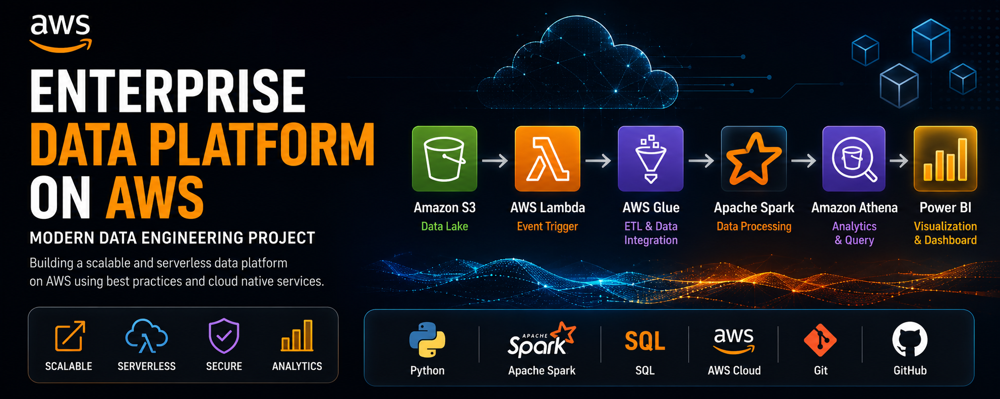

# enterprise-data-platform-aws
Enterprise Data Engineering Project on AWS using S3, Glue, Spark, Athena and Power BI.

    

# Enterprise Data Platform on AWS

Enterprise Data Engineering project built using AWS cloud services, Apache Spark and serverless technologies.

---

# 🏗️ Architecture

The following architecture represents the complete end-to-end Enterprise Data Platform built on AWS.

---