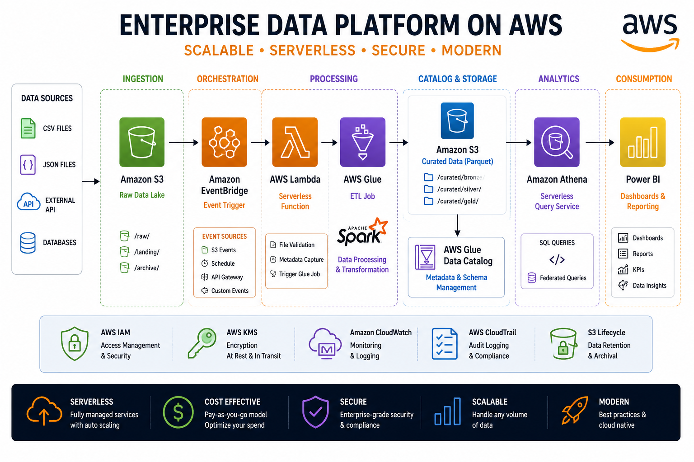
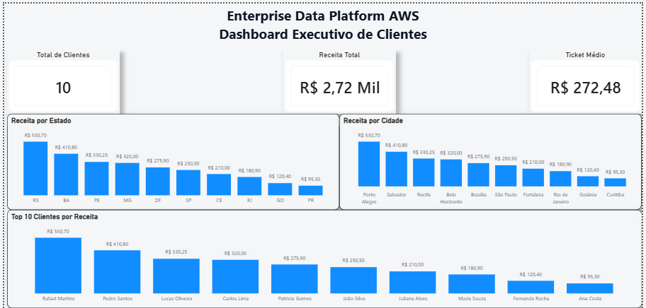

# 🚀 Enterprise Data Platform AWS


---

# 📖 Overview

Enterprise Data Platform AWS is an end-to-end Data Engineering project that demonstrates the complete lifecycle of data ingestion, processing, cataloging, querying and visualization using AWS native services.

The solution was built following a modern Data Lake architecture and Infrastructure as Code (Terraform).

---

# 🏗 Architecture

<p align="center">

</p>

---

# 🔄 Data Pipeline

```
CSV Dataset

        │

        ▼

Amazon S3 (Landing)

        │

        ▼

AWS Lambda

        │

        ▼

Amazon S3 (Raw)

        │

        ▼

AWS Glue Crawler

        │

        ▼

Glue Data Catalog

        │

        ▼

AWS Glue ETL Job

        │

        ▼

Amazon S3 (Processed)

        │

        ▼

Amazon Athena

        │

        ▼

Power BI Dashboard
```

---

# ☁ AWS Services Used

* Amazon S3
* AWS Lambda
* AWS Glue
* AWS Glue Crawlers
* AWS Glue Data Catalog
* AWS Glue ETL Jobs
* Amazon Athena
* AWS IAM
* CloudWatch
* Terraform

---

# 🛠 Technologies

* Python
* SQL
* Terraform
* Power BI
* Git
* GitHub

---

# 📂 Project Structure

```
enterprise-data-platform-aws

│

├── architecture/
│     architecture.png

├── dashboard/
│     dashboard.png

├── lambda/
│     lambda_ingestion.py

├── glue/
│     etl_process_clientes.py

├── terraform/
│     provider.tf
│     variables.tf
│     s3.tf
│     iam.tf
│     lambda.tf
│     glue.tf
│     athena.tf
│     outputs.tf

├── powerbi/
│     EnterpriseDataPlatform.pbix

├── data/
│     clientes.csv

└── README.md
```

---

# ⚙ Infrastructure as Code

The infrastructure was defined using Terraform.

Main resources:

* Amazon S3 Bucket
* Lambda Function
* IAM Roles
* AWS Glue Catalog
* AWS Glue Crawler
* AWS Glue Job
* Athena Workgroup

---

# 📊 Dashboard

<p align="center">

</p>

Dashboard KPIs

* Total Customers
* Total Revenue
* Average Ticket
* Revenue by State
* Customers by City
* Customer Detail Table

---

# 📌 ETL Flow

### 1. Data Landing

CSV files are uploaded into:

```
landing/
```

---

### 2. Data Ingestion

AWS Lambda automatically validates and copies incoming files to the Raw layer.

---

### 3. Raw Layer

Stores immutable source data.

```
raw/
```

---

### 4. Metadata Discovery

Glue Crawlers scan Raw files and automatically create/update tables inside Glue Catalog.

---

### 5. Data Processing

Glue ETL transforms raw datasets into optimized Parquet files.

Output:

```
processed/
```

---

### 6. Query Layer

Amazon Athena performs SQL queries directly over the processed Parquet files.

---

### 7. Business Intelligence

Power BI connects to Athena through ODBC and builds interactive dashboards.

---

# 🚀 Features

✔ Serverless Architecture

✔ Automatic Ingestion

✔ Data Catalog

✔ ETL Processing

✔ SQL Analytics

✔ Interactive Dashboard

✔ Infrastructure as Code

---

# 📈 Results

This project demonstrates:

* Cloud Data Lake Architecture
* Data Engineering Best Practices
* Serverless Processing
* Infrastructure Automation
* Business Intelligence Integration

---

# 🔮 Future Improvements

* Amazon SNS Notifications
* EventBridge Scheduling
* CI/CD with GitHub Actions
* CloudWatch Alarms
* AWS Step Functions
* Lake Formation
* Data Quality Rules
* Unit Tests
* Automated Deployments

---

# ▶ How to Run

## Clone Repository

```
git clone https://github.com/SEU_USUARIO/enterprise-data-platform-aws.git
```

---

## Terraform

```
terraform init

terraform plan
```

---

## Upload CSV

Upload datasets into

```
landing/
```

Lambda will automatically trigger the ingestion pipeline.

---

## Run Glue ETL

Execute the Glue Job

```
etl-process-clientes
```

---

## Query with Athena

Example

```sql
SELECT *

FROM enterprise_data_platform.raw_raw

LIMIT 10;
```

---

## Open Dashboard

Open

```
powerbi/EnterpriseDataPlatform.pbix
```

Refresh the data.

---

# 👨‍💻 Author

**Marcelo Mendes**

Computer Engineer

Data Engineering | Cloud | AWS | Python | SQL | Terraform | Power BI | Databricks

GitHub

https://github.com/MarcelloMendes

LinkedIn

https://www.linkedin.com/in/marcelomendes-/

---

⭐ If you found this project useful, consider giving it a star.
